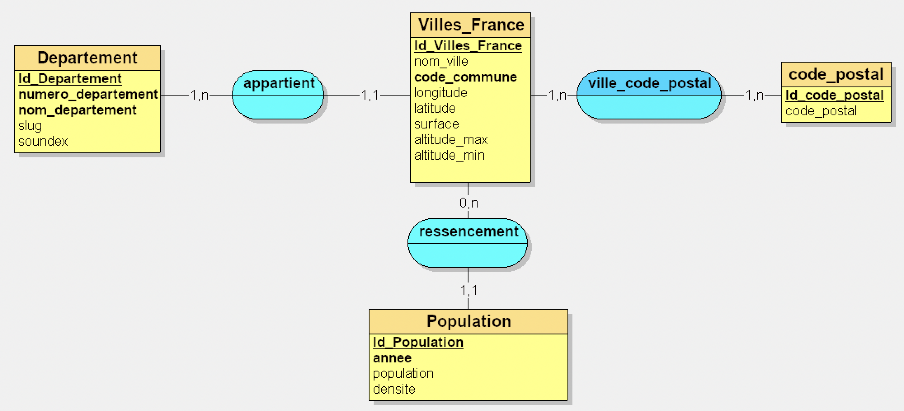
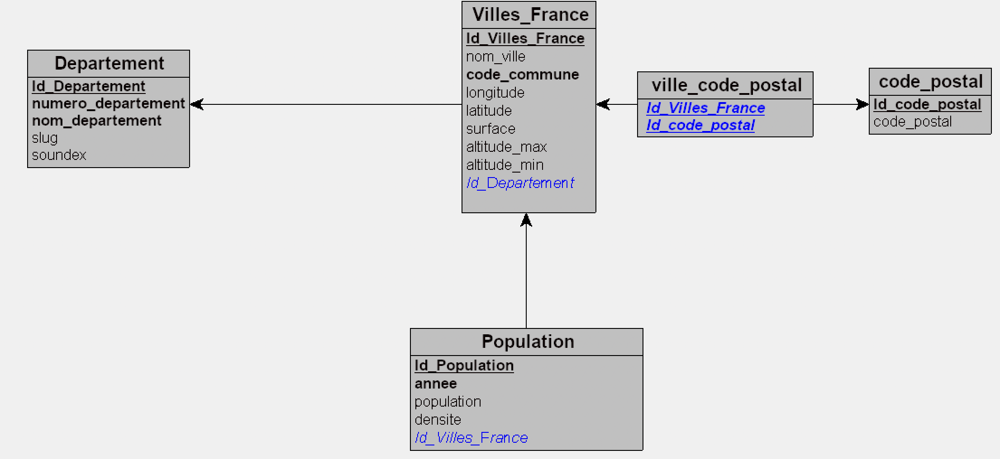

# TP8 : Optimisation
1. Lister les erreurset/ou axes d'amélioration de la base villes et départements

| Erreurs | Amélioration possibles |
|----|----|
|Globalement sur les 2 tables les id ne sont pas en auto-incrémentation, risque d'erreur| Passer toutes les clés primaire en auto-incrémentation|
|Globalement pas de contraintes sur les colonnes| Mettre en not null quand obligatoire, ou unique sur les données qui ont à l'être|
|--- **table département** ---|----------------------|
|Trop de colonnes redondantes (département nom/département nom uppercase, département slug)| garder une unique colonne "nom de département" et traiter le uppercase, les espaces remplacés par des - dans les requêtes |
|--- **table villes de France** ---|----------------------|
|Trop de colonnes inutiles| FK avec table départements pour les infos départementales -> nom/numéro de département|
|Les colonnes ville/villes nom réel | Garder une seule colonne ville et faire les traitements en requête |
|Colonne ville code commune| inutile, la gérer avec un ```CONCAT(Departement.numero, ville.commune)```|
|colonnes ressencement population| faire une table à part avec les populations pour les différentes années |
|trie des colonnes | Plusieurs colonnes avec des infos vide et/ou inutiles, soit à regrouper dans une colonnes "divers" soit à supprimer (colonne amdi, latitude_dms, zmin, ...) |

2. Création d'un MLD.  

J'ai fais un MLD qui me semblait plus correcte avec les données accumulées : 
- une table Departement avec :
  - id_departement en auto-incrémentation
  - numéro de département INT avec contrainte unicité
  - slug pour avoir sans les accents
  - soundex pour la prononciation
- table ville_de_france : 
  - un id auto-incrémentée
  - nom de ville
  - code de la commune (unique)
  - FK département
  - longitude (en deg)
  - latitude (en deg)
  - surface
  - altitude max
  - altitude min
- table code postaux
  - un id unique auto-incrémenté
- table pivot ville_code postaux
  - FK ville
  - FK code postal
- table population : 
  - un id auto incrémenté
  - FK ville
  - années unique et not null
  - nombre de la population
  - densité




3. Création de la nouvelle DB.  
