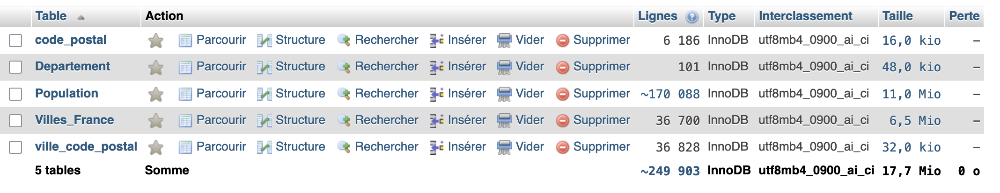
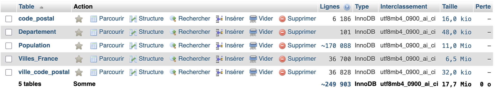
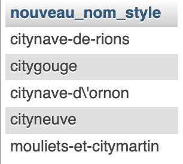

# TP8 : Optimisation
1. Lister les erreurset/ou axes d'amélioration de la base villes et départements

| Erreurs | Amélioration possibles |
|----|----|
|Globalement sur les 2 tables les id ne sont pas en auto-incrémentation, risque d'erreur| Passer toutes les clés primaire en auto-incrémentation|
|Globalement pas de contraintes sur les colonnes| Mettre en not null quand obligatoire, ou unique sur les données qui ont à l'être|
|--- **table département** ---|----------------------|
|Trop de colonnes redondantes (département nom/département nom uppercase, département slug)| garder une unique colonne "nom de département" et traiter le uppercase, les espaces remplacés par des - dans les requêtes |
|--- **table villes de France** ---|----------------------|
|Trop de colonnes inutiles| FK avec table départements pour les infos départementales -> nom/numéro de département|
|Les colonnes ville/villes nom réel | Garder une seule colonne ville et faire les traitements en requête |
|Colonne ville code commune| inutile, la gérer avec un ```CONCAT(Departement.numero, ville.commune)```|
|colonnes ressencement population| faire une table à part avec les populations pour les différentes années |
|trie des colonnes | Plusieurs colonnes avec des infos vide et/ou inutiles, soit à regrouper dans une colonnes "divers" soit à supprimer (colonne amdi, latitude_dms, zmin, ...) |

2. Création d'un MLD.  

J'ai fais un MLD qui me semblait plus correcte avec les données accumulées : 
- une table Departement avec :
  - id_departement en auto-incrémentation
  - numéro de département INT avec contrainte unicité
  - slug pour avoir sans les accents
  - soundex pour la prononciation
- table ville_de_france : 
  - un id auto-incrémentée
  - nom de ville
  - code de la commune (unique)
  - FK département
  - longitude (en deg)
  - latitude (en deg)
  - surface
  - altitude max
  - altitude min
- table code postaux
  - un id unique auto-incrémenté
- table pivot ville_code postaux
  - FK ville
  - FK code postal
- table population : 
  - un id auto incrémenté
  - FK ville
  - années unique et not null
  - nombre de la population
  - densité


3. Création de la nouvelle DB.  
Utilisation de script en PHP pour parcourir les aanciennes tables en SQL, et faire des fichiers de migrations SQL pour les nouvelles tables (Département en premier, puis villes, puis code postal et code_postal_ville et enfin population).
Il faut ensuite importer le contenu des nouvelles tables dans phpmyadmin.

4. Vérifier que tout est OK et optimiser les tables



```sql
OPTIMIZE TABLE `code_postal`, `Departement`, `Population`, `Villes_France`, `ville_code_postal`; 
```


Pas de différence dans le poids de mes tables entre le avant et le après.

5. Exécuter des requêtes
  - nombre total de ville en Gironde
  ```sql
  SELECT COUNT(Villes_France.nom_ville) 
  FROM Villes_France 
  INNER JOIN Departement ON Departement.Id_Departement = Villes_France.Id_Departement 
  WHERE Departement.numero_departement = 33;
  ```
  Et ça retourne 542 villes dans la Gironde (département 33).

  - Calcul de la densité de population moyenne des villes girondines en 2010
  ```sql
  SELECT AVG(Population.densite) AS densite_gironde_2010 
  FROM `Population` 
  INNER JOIN Villes_France ON Villes_France.Id_Villes_France = Population.Id_Villes_France
  INNER JOIN Departement ON Departement.Id_Departement = Villes_France.Id_Departement
  WHERE Departement.numero_departement = 33 
  AND Population.annee = 2010;
  ```
  Ce qui me retourne : 191.2694
  - Nombre d'habitant moyen en 2012 (toujours Gironde)
  ```sql
  SELECT AVG(Population.population) AS habitant_moyen_gironde_2012 
  FROM `Population` 
  INNER JOIN Villes_France ON Villes_France.Id_Villes_France = Population.Id_Villes_France
  INNER JOIN Departement ON Departement.Id_Departement = Villes_France.Id_Departement
  WHERE Departement.numero_departement = 33 AND Population.annee = 2012;
  ```
  Et j'ai 2623.8007 habitants
  - Choisir une ville au hasard et passer son nom en minuscule
  ```sql
  SELECT Villes_France.Id_Villes_France AS ID_ville, 
  LCASE(Villes_France.nom_ville) AS nom_ville_minuscule
  FROM Villes_France 
  INNER JOIN Departement ON Departement.Id_Departement = Villes_France.Id_Departement 
  WHERE Departement.numero_departement = 33
  ORDER BY RAND()
  LIMIT 1;
  ```
  Cette requête randomise les sorties, je me limite à 1 seule et donc j'ai une ville girondine au hasard. Je l'affiche en lowercase avec la fonction ```LCASE()``` ou ```LOWER()```

  - Rechercher les villes qui comportent le mot "ville" et le remplacer par "city"
  ```sql 
  SELECT REPLACE(Villes_France.nom_ville, 'VILLE', 'city'), LCASE(Villes_France.nom_ville) AS nom
  FROM Villes_France 
  INNER JOIN Departement ON Departement.Id_Departement = Villes_France.Id_Departement 
  WHERE Departement.numero_departement = 33
  AND Villes_France.nom_ville LIKE '%VILLE%';

  SELECT LCASE(REPLACE(Villes_France.nom_ville, 'VILLE', 'city')) AS nouveau_nom_style
  FROM Villes_France 
  INNER JOIN Departement ON Departement.Id_Departement = Villes_France.Id_Departement 
  WHERE Departement.numero_departement = 33
  AND Villes_France.nom_ville LIKE '%VILLE%';
  ```
  

  - Caculer la population totale de 2010 pour chaque départements
  ```sql
  SELECT SUM(Population.population) AS total_pop, Departement.nom_departement FROM Population
  INNER JOIN Villes_France ON Villes_France.Id_Villes_France = Population.Id_Villes_France
  INNER JOIN Departement ON Departement.Id_Departement = Villes_France.Id_Departement
  WHERE Population.annee = 2010
  GROUP BY Departement.nom_departement
  ORDER BY total_pop DESC
  ```
  Et j'ai 5 153 540 habitants dans le département Nord (59) et 4 487 666 habitants pour Paris (93)

  - Nom des départements avec une populations supérieure à 2 millions :
  ```sql
  SELECT SUM(Population.population) AS total_pop, 
  Departement.nom_departement 
  FROM Population
  INNER JOIN Villes_France ON Villes_France.Id_Villes_France = Population.Id_Villes_France
  INNER JOIN Departement ON Departement.Id_Departement = Villes_France.Id_Departement
  WHERE Population.annee = 2010
  GROUP BY Departement.nom_departement
  HAVING total_pop > 2000000
  ORDER BY total_pop DESC;
  ```

  - Nom du département avec le plus grand nombre de ville
  ```sql
  SELECT COUNT(DISTINCT Villes_France.Id_Villes_France) AS nombre_villes,
  Departement.nom_departement
  FROM Villes_France
  INNER JOIN Departement ON Departement.Id_Departement = Villes_France.Id_Departement
  GROUP BY Departement.nom_departement
  ORDER BY nombre_villes DESC
  LIMIT 1;
  ```
  Et j'ai le Nord-Pas-de-Calais avec 895 villes.

  - Nom du département avec la densité de population la moins élevée
  ```sql
  SELECT Population.densite AS densite, 
  Departement.nom_departement
  FROM Population
  INNER JOIN Villes_France ON Villes_France.Id_Villes_France = Population.Id_Villes_France
  INNER JOIN Departement ON Departement.Id_Departement = Villes_France.Id_Departement
  WHERE Population.densite IS NOT NULL AND Population.densite != 0 AND Population.annee = 2010
  ORDER BY densite ASC
  LIMIT 1;
  ```
  - Nombre de ville par départements, seulement si le département à + de 50 villes :
  ```sql
  SELECT COUNT(DISTINCT Villes_France.Id_Villes_France) AS nombre_villes,
  Departement.nom_departement
  FROM Villes_France
  INNER JOIN Departement ON Departement.Id_Departement = Villes_France.Id_Departement
  GROUP BY Departement.nom_departement
  HAVING nombre_villes > 50
  ORDER BY nombre_villes DESC;
  ```
  - Ville dont la population en 2010 < pop en 1999